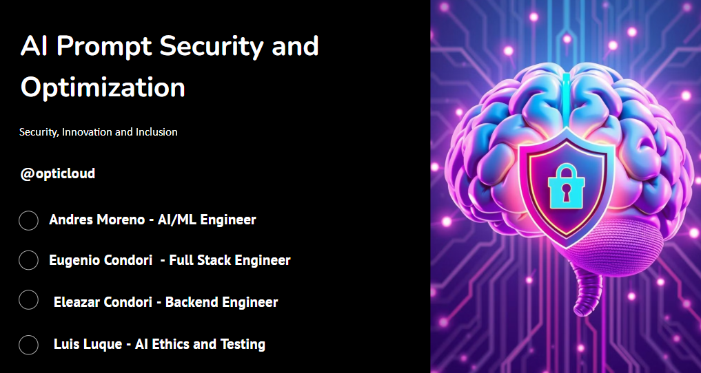
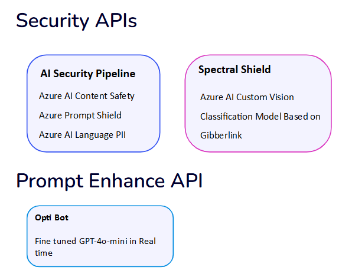
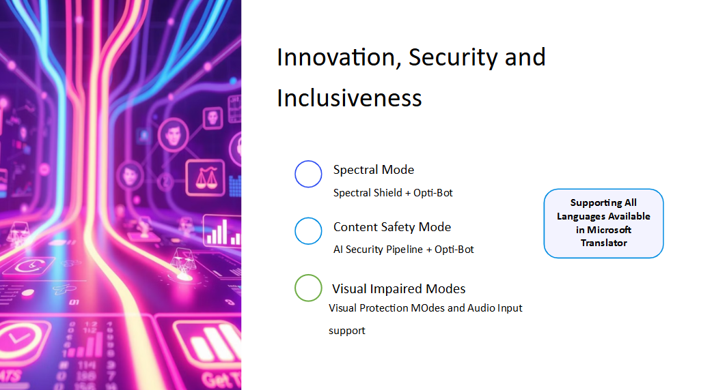
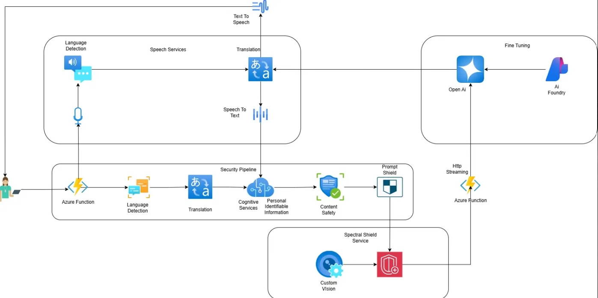

# Microsoft Innovation Challenge Hackaton March 2025



## Challenge: Auto Correct and Prompt Validation Before AI Execution

### Challenge Overview

How could a prompt pre-processing layer be implemented that would identify and correct grammatical errors, incomplete queries, or unclear inputs? How do you help users by flagging harmful or sensitive language in their prompts and suggesting safe and ethical alternatives? At same time, can you enhance the clarity and precision of prompts to improve AI output quality? For this project, design a system that auto-corrects and validates user inputs before sending them to the AI, ensuring that prompts are optimized, compliant, and free of potential risks (e.g., bias, harmful language, or sensitive data).

## Our Solution







Slides: 

https://docs.google.com/presentation/d/1Kc8YplbuSZ13aiKOSBfQNZymO-lbdoxgBjnx87-dnGE/edit#slide=id.g33afea76789_0_95

## Demo 

<video src="./data/opti_cloud.mp4" width="320" height="240" controls></video>

Full demos is available here: 

https://www.youtube.com/watch?v=SmXP05fLER4

## Project Installation: 

1) Create a new environment with Python 3.9:

```sh
conda create -n my_environment python=3.9
```

2) Install dependencies

```sh
pip install -r requirements.txt
```